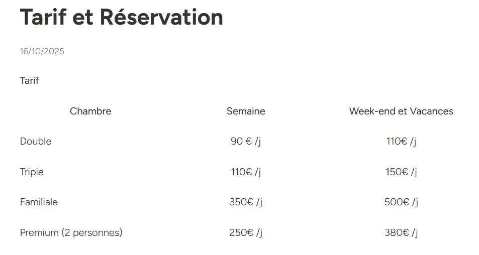

# *Git'ELH* - Site de gîte fictif (WordPress)

Ce projet est un **site WordPress** créé pour mon gîte fictif situé en Côte d'Azur, à Nice.
Il a été réalisé dans le cadre de mon **BTS SIO** pour apprendre à maîtriser la personnalisation d'un CMS et le web design.

---

### Technologies utilisées

- WordPress CMS
- Elementor (en grande partie)
- HTML et CSS pour les styles personnalisés
- Plugins

---

### Fonctionnalités

- Présentation du gîte, tarifs et activités
- Formulaire de contact
- Design **responsive** (pc, tablette et mobile)

---

### Aperçu du site

<table>
  <tr>
    <th>Capture de l'accueil du site :</th>
    <th>Capture des tarifs du gîte :</th>
  </tr>
  <tr>
    <td></td>
    <td></td>
  </tr>
</table>

---

### Lien vers le site du gîte

Vous pouvez voir ici le site en ligne : [Site Git'ELH](https://shirineelhani-rgpio.wordpress.com/)
